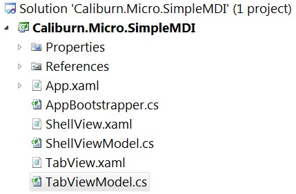
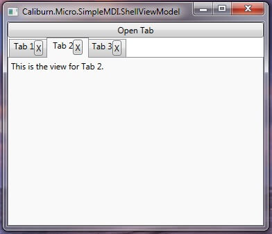
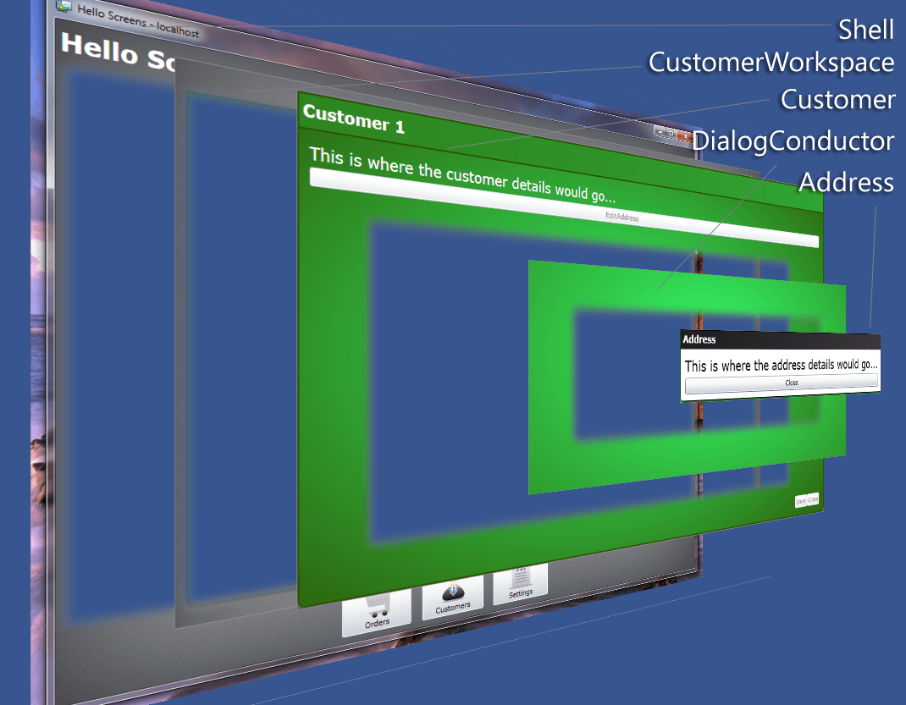

# Screens, Conductors and Composition

The Screens and Conductors piece of Caliburn.Light is probably most important to understand if you want your UI to be engineered well. It’s particularly important if you want to leverage composition. The terms Screen, Screen Conductor and Screen Collection have more recently been codified by Jeremy Miller during his work on the book "Presentation Patterns" for Addison Wesley. While these patterns are primarily used in CL by inheriting ViewModels from particular base classes, it’s important to think of them as roles rather than as View-Models. In fact, depending on your architecture, a Screen could be a UserControl, Presenter or ViewModel. That’s getting a little ahead of ourselves though. First, let’s talk about what these things are in general.

### Theory

##### Screen
This is the simplest construct to understand. You might think of it as a stateful unit of work existing within the presentation tier of an application. It’s independent from the application shell. The shell may display many different screens, some even at the same time. The shell may display lots of widgets as well, but these are not part of any screen. Some screen examples might be a modal dialog for application settings, a code editor window in Visual Studio or a page in a browser. You probably have a pretty good intuitive sense about this.

Often times a screen has a lifecycle associated with it which allows the screen to perform custom activation and deactivation logic. This is what Jeremy calls the ScreenActivator. For example, take the Visual Studio code editor window. If you are editing a C# code file in one tab, then you switch to a tab containing an XML document, you will notice that the toolbar icons change. Each one of those screens has custom activation/deactivation logic that enables it to setup/teardown the application toolbars such that they provide the appropriate icons based on the active screen. In simple scenarios, the ScreenActivator is often the same class as the Screen. However, you should remember that these are two separate roles. If a particular screen has complex activation logic, it may be necessary to factor the ScreenActivator into its own class in order to reduce the complexity of the Screen. This is particularly important if you have an application with many different screens, but all with the same activation/deactivation logic.

##### Screen Conductor
Once you introduce the notion of a Screen Activation Lifecycle into your application, you need some way to enforce it. This is the role of the ScreenConductor. When you show a screen, the conductor makes sure it is properly activated. If you are transitioning away from a screen, it makes sure it gets deactivated. There’s another scenario that’s important as well. Suppose that you have a screen which contains unsaved data and someone tries to close that screen or even the application. The ScreenConductor, which is already enforcing deactivation, can help out by implementing Graceful Shutdown. In the same way that your Screen might implement an interface for activation/deactivation, it may also implement some interface which allows the conductor to ask it “Can you close?” This brings up an important point: in some scenarios deactivating a screen is the same as closing a screen and in others, it is different. For example, in Visual Studio, it doesn’t close documents when you switch from tab to tab. It just activates/deactivates them. You have to explicitly close the tab. That is what triggers the graceful shutdown logic. However, in a navigation based application, navigating away from a page would definitely cause deactivation, but it might also cause that page to close. It all depends on your specific application’s architecture and it’s something you should think carefully about.

##### Screen Collection
In an application like Visual Studio, you would not only have a ScreenConductor managing activation, deactivation, etc., but would also have a ScreenCollection maintaining the list of currently opened screens or documents. By adding this piece of the puzzle, we can also solve the issue of deactivation vs. close. Anything that is in the ScreenCollection remains open, but only one of those items is active at a time. In an MDI-style application like VS, the conductor would manage switching the active screen between members of the ScreenCollection. Opening a new document would add it to the ScreenCollection and switch it to the active screen. Closing a document would not only deactivate it, but would remove it from the ScreenCollection. All that would be dependent on whether or not it answers the question “Can you close?” positively. Of course, after the document is closed, the conductor needs to decide which of the other items in the ScreenCollection should become the next active document.

### Implementations
There are lots of different ways to implement these ideas. You could inherit from a TabControl and implement an IScreenConductor interface and build all the logic directly in the control. Add that to your IoC container and you’re off and running. You could implement an IScreen interface on a custom UserControl or you could implement it as a POCO used as a base for Supervising Controllers. ScreenCollection could be a custom collection with special logic for maintaining the active screen, or it could just be a simple IList<IScreen>.

#### Caliburn.Light Implementations
These concepts are implemented in CL through various interfaces and base classes which can be used mostly to build ViewModels. Let’s take a look at them:

##### Screens
In Caliburn.Light we have broken down the notion of screen activation into several interfaces:

 - IActivate – Indicates that the implementer requires activation. This interface provides an Activate method, an IsActive property and an Activated event which should be raised when activation occurs.
 - IDeactivate – Indicates that the implementer requires deactivation. This interface has a Deactivate method which takes a bool property indicating whether to close the screen in addition to deactivating it. It also has two events: AttemptingDeactivation, which should be raised before deactivation and Deactivated which should be raised after deactivation.
 - ICloseGuard – Indicates that the implementer may need to cancel a close operation. It has one method: CanCloseAsync. This method is designed with an async pattern, allowing complex logic such as async user interaction to take place while making the close decision. The caller will await the CanCloseAsync method. The async Task should return true to indicate that the implementer can close, false otherwise.

In addition to these core lifecycle interfaces, we have a few others to help in creating consistency between presentation layer classes:

 - IHaveDisplayName – Has a single property called DisplayName
 - IBindableObject – This interface inherits from the standard INotifyPropertyChanged and augments it with additional behaviors. It adds a SuspendNotifications method which can be used to turn off/on all change notification and a Refresh method which can be used to refresh all bindings on the object.
 - IBindableCollection<T> – Composes the following interfaces: IList<T>, IBindableObject and INotifyCollectionChanged
 - IChild – Implemented by elements that are part of a hierarchy or that need a reference to an owner. It has one property named Parent.
 - IViewAware – Implemented by classes which need to be made aware of the view that they are bound to. It has an AttachView method which is called by the framework when it binds the view to the instance. It has a GetView method which the framework calls before creating a view for the instance. This enables caching of complex views or even complex view resolution logic. Finally, it has an event which should be raised when a view is attached to the instance called ViewAttached.

Because certain combinations are so common, we have some convenience interfaces and base classes:

 - BindableObject – Implements IBindableObject (and thus INotifyPropertyChanged).
 - BindableCollection – Implements IBindableCollection<T> by inheriting from the standard ObservableCollection<T> and adding the additional behavior specified by IBindableObject.
 - IScreen – This interface composes several other interfaces: IActivate, IDeactivate, ICloseGuard and IBindableObject.
 - Screen – Inherits from BindableObject and implements the IScreen interface. Additionally IViewAware is implemented.

What this all means is that you will probably inherit most of your view models from either BindableObject or Screen. Generally speaking, you would use Screen if you need any of the activation features and BindableObject for everything else. CL’s default Screen implementation has a few additional features as well and makes it easy to hook into the appropriate parts of the lifecycle:

 - OnInitialize – Override this method to add logic which should execute only the first time that the screen is activated. After initialization is complete, IsInitialized will be true.
 - OnActivate – Override this method to add logic which should execute every time the screen is activated. After activation is complete, IsActive will be true.
 - OnDeactivate – Override this method to add custom logic which should be executed whenever the screen is deactivated or closed. The bool property will indicated if the deactivation is actually a close. After deactivation is complete, IsActive will be false.
 - CanCloseAsync – The default implementation always allows closing. Override this method to add custom guard logic.
 - TryClose – Call this method to close the screen. If the screen is being controlled by a Conductor, it asks the Conductor to initiate the shutdown process for the Screen. If the Screen is not controlled by a Conductor, but exists independently (perhaps because it was shown using the WindowManager), this method attempts to close the view. In both scenarios the CanCloseAsync logic will be invoked and if allowed, OnDeactivate will be called with a value of true.

So, just to re-iterate: if you need a lifecycle, inherit from Screen; otherwise inherit from BindableObject.

##### Conductors

As I mentioned above, once you introduce lifecycle, you need something to enforce it. In Caliburn.Light, this role is represented by the IConductor interface which has the following members:

 - ActivateItem – Call this method to activate a particular item. It will also add it to the currently conducted items if the conductor is using a “screen collection.”
 - DeactivateItem – Call this method to deactivate a particular item. The second parameter indicates whether the item should also be closed. If so, it will also remove it from the currently conducted items if the conductor is using a “screen collection.”
 - ActivationProcessed – Raised when the conductor has processed the activation of an item. It indicates whether or not the activation was successful.
 - GetChildren – Call this method to return a list of all the items that the conductor is tracking. If the conductor is using a “screen collection,” this returns all the “screens,” otherwise this only returns ActiveItem. (From the IParent interface)
 - IBindableObject – This interface is composed into IConductor.

We also have an interface called IConductActiveItem which composes IConductor and IHaveActiveItem to add the following member:
 
 - ActiveItem – A property that indicates what item the conductor is currently tracking as active.

You may have noticed that CL’s IConductor interface uses the term “item” rather than “screen” and that I was putting the term “screen collection” in quotes. The reason for this is that CL’s conductor implementations do not require the item being conducted to implement IScreen or any particular interface. Conducted items can be POCOs. Rather than enforcing the use of IScreen, each of the conductor implementations is generic, with no constraints on the type. As the conductor is asked to activate/deactivate/close/etc each of the items it is conducting, it checks them individually for the following fine-grained interfaces: IActivate, IDeactive, IGuardClose and IChild. In practice, I usually inherit conducted items from Screen, but this gives you the flexibility to use your own base class, or to only implement the interfaces for the lifecycle events you care about on a per-class basis. You can even have a conductor tracking heterogeneous items, some of which inherit from Screen and others that implement specific interfaces or none at all.

Out of the box CL has three implementations of IConductor, two that work with a “screen collection” and one that does not. We’ll look at the conductor without the collection first. 

##### Conductor<T>

This simple conductor implements the majority of IConductor’s members through explicit interface mechanisms and adds strongly typed versions of the same methods which are available publicly. This allows working with conductors generically through the interface as well as in a strongly typed fashion based on the items they are conducting. The Conductor<T> treats deactivation and closing synonymously. Since the Conductor<T> does not maintain a “screen collection,” the activation of each new item causes both the deactivation and close of the previously active item. The actual logic for determining whether or not the conducted item can close can be complex due to the async nature of IGuardClose and the fact that the conducted item may or may not implement this interface. Therefore, the conductor delegates this to an ICloseStrategy<T> which handles this and tells the conductor the results of the inquiry. Most of the time you’ll be fine with the DefaultCloseStrategy<T> that is provided automatically, but should you need to change things (perhaps IGuardClose is not sufficient for your purposes) you can set the CloseStrategy property on Conductor<T> to your own custom strategy.

##### Conductor<T>.Collection.OneActive

This implementation has all the features of Conductor<T> but also adds the notion of a “screen collection.” Since conductors in CL can conduct any type of class, this collection is exposed through an IObservableCollection<T> called Items rather than Screens. As a result of the presence of the Items collection, deactivation and closing of conducted items are not treated synonymously. When a new item is activated, the previous active item is deactivated only and it remains in the Items collection. To close an item with this conductor, you must explicitly call its CloseItem method. When an item is closed and that item was the active item, the conductor must then determine which item should be activated next. By default, this is the item before the previous active item in the list. If you need to change this behavior, you can override DetermineNextItemToActivate.

##### Conductor<T>.Collection.AllActive

Similarly, this implementation also has the features of Conductor<T> and adds the notion of a "screen collection." The main difference is that rather than a single item being active at one time, many items can be active. Closing an item deactivates it and removes it from the collection.

There are two very important details about CLs IConductor implementations that I have not mentioned yet. First, they both inherit from Screen. This is a key feature of these implementations because it creates a composite pattern between screens and conductors. So, let’s say you are building a basic navigation-style application. Your shell would be an instance of Conductor<IScreen> because it shows one Screen at a time and doesn’t maintain a collection. But, let’s say that one of those screens was very complicated and needed to have a multi-tabbed interface requiring lifecycle events for each tab. Well, that particular screen could inherit from Conductor<T>.Collection.OneActive. The shell need not be concerned with the complexity of the individual screen. One of those screens could even be a UserControl that implemented IScreen instead of a ViewModel if that’s what was required. The second important detail is a consequence of the first. Since all OOTB implementations of IConductor inherit from Screen it means that they too have a lifecycle and that lifecycle cascades to whatever items they are conducting. So, if a conductor is deactivated, its ActiveItem will be deactivated as well. If you try to close a conductor, it’s going to only be able to close if all of the items it conducts can close. This turns out to be a very powerful feature. There’s one aspect about this that I’ve noticed frequently trips up developers. **If you activate an item in a conductor that is itself not active, that item won’t actually be activated until the conductor gets activated.** This makes sense when you think about it, but can occasionally cause hair pulling.

##### Quasi-Conductors

Not everything in CL that can be a screen is rooted inside of a Conductor. For example, what about the your root view model? If it’s a conductor, who is activating it? Well, that’s one of the jobs that the Bootstrapper performs. The Bootstrapper itself is not a conductor, but it understands the fine-grained lifecycle interfaces discussed above and ensures that your root view model is treated with the respect it deserves. The WindowManager works in a similar way by acting a little like a conductor for the purpose of enforcing the lifecycle of your modal (and modeless - WPF only) windows. So, lifecycle isn’t magical. All your screens/conductors must be either rooted in a conductor or managed by the Bootstrapper or WindowManager to work properly; otherwise you are going to need to manage the lifecycle yourself.

##### View-First

If you are working with WinRT Navigation Framework, you may be wondering if/how you can leverage screens and conductors. So far, I’ve been assuming a primarily ViewModel-First approach to shell engineering. But the WinRT platform enforces a View-First approach by controlling page navigation. In this case, the Nav Framework acts like a conductor. In order to make this play well with ViewModels, the WinRT version of CL has a FrameAdapter which hooks into the NavigationService. This adapter, which is set up by the CalliburnApplication, understands the same fine-grained lifecycle interfaces that conductors do and ensures that they are called on your ViewModels at the appropriate points during navigation. You can even cancel the page navigation by implementing ICloseGuard on your ViewModel.

### Simple Navigation


Previously, we discussed the theory and basic APIs for Screens and Conductors in Caliburn.Light. Now I would like to walk through the first of several samples. This particular sample demonstrates how to set up a simple navigation-style shell using Conductor<T> and two “Page” view models. As you can see from the project structure, we have the typical pattern of Bootstrapper and ShellViewModel. In order to keep this sample as simple as possible, I’m not even using an IoC container with the Bootstrapper. Let’s look at the ShellViewModel first. It inherits from Conductor<object> and is implemented as follows:

``` csharp
public class ShellViewModel : Conductor<object> {
    public ShellViewModel() {
        ShowPageOne();
    }

    public void ShowPageOne() {
        ActivateItem(new PageOneViewModel());
    }

    public void ShowPageTwo() {
        ActivateItem(new PageTwoViewModel());
    }
}
```

Here is the corresponding ShellView:

``` xml
<UserControl x:Class="Caliburn.Light.SimpleNavigation.ShellView"
             xmlns="http://schemas.microsoft.com/winfx/2006/xaml/presentation"
             xmlns:x="http://schemas.microsoft.com/winfx/2006/xaml"
             xmlns:tc="clr-namespace:System.Windows.Controls;assembly=System.Windows.Controls.Toolkit">
    <tc:DockPanel>
        <StackPanel Orientation="Horizontal"
                    HorizontalAlignment="Center"
                    tc:DockPanel.Dock="Top">
            <Button x:Name="ShowPageOne"
                    Content="Show Page One" />
            <Button x:Name="ShowPageTwo"
                    Content="Show Page Two" />
        </StackPanel>

        <ContentControl x:Name="ActiveItem" />
    </tc:DockPanel>
</UserControl>
```

Notice that the ShellViewModel has two methods, each of which passes a view model instance to the ActivateItem method. Recall from our earlier discussion that ActivateItem is a method on Conductor<T> which will switch the ActiveItem property of the conductor to this instance and push the instance through the activation stage of the screen lifecycle (if it supports it by implementing IActivate). Recall also, that if ActiveItem is already set to an instance, then before the new instance is set, the previous instance will be checked for an implementation of IGuardClose which may or may not cancel switching of the ActiveItem. Assuming the current ActiveItem can close, the conductor will then push it through the deactivation stage of the lifecycle, passing true to the Deactivate method to indicate that the view model should also be closed. This is all it takes to create a navigation application in Caliburn.Light. The ActiveItem of the conductor represents the “current page” and the conductor manages the transitions from one page to the other. This is all done in a ViewModel-First fashion since it’s the conductor and it’s child view models that are driving the navigation and not the “views.”

Once the basic Conductor structure is in place, it’s quite easy to get it rendering. The ShellView demonstrates this. All we have to do is place a ContentControl in the view. By naming it “ActiveItem” our data binding conventions kick in. The convention for ContentControl is a bit interesting. If the item we are binding to is not a value type and not a string, then we assume that the Content is a ViewModel. So, instead of binding to the Content property as we would in the other cases, we actually set up a binding with CL’s custom attached property: View.Model. This property causes CL’s ViewLocator to look up the appropriate view for the view model and CL’s ViewModelBinder to bind the two together. Once that is complete, we pop the view into the ContentControl’s Content property. This single convention is what enables the powerful, yet simple ViewModel-First composition in the framework.

For completeness, let’s take a look at the PageOneViewModel and PageTwoViewModel:

``` csharp
public class PageOneViewModel {}

public class PageTwoViewModel : Screen {
    protected override void OnActivate() {
        MessageBox.Show("Page Two Activated"); //Don't do this in a real VM.
        base.OnActivate();
    }
}
```

Along with their views:

``` xml
<UserControl x:Class="Caliburn.Light.SimpleNavigation.PageOneView"
             xmlns="http://schemas.microsoft.com/winfx/2006/xaml/presentation"
             xmlns:x="http://schemas.microsoft.com/winfx/2006/xaml">
    <TextBlock FontSize="32">Page One</TextBlock>
</UserControl>

<UserControl x:Class="Caliburn.Light.SimpleNavigation.PageTwoView"
             xmlns="http://schemas.microsoft.com/winfx/2006/xaml/presentation"
             xmlns:x="http://schemas.microsoft.com/winfx/2006/xaml">
    <TextBlock FontSize="32">Page Two</TextBlock>
</UserControl>
```

I’d like to point out a few final things. Notice that PageOneViewModel is just a POCO, but PageTwoViewModel inherits from Screen. Remember that the conductors in CL don’t place any constraints on what can be conducted. Rather, they check each instance for support of the various fine-grained lifecycle instances at the necessary times. So, when ActivateItem is called for PageTwoViewModel, it will first check PageOneViewModel to see if it implements IGuardClose. Since it does not, it will attempt to close it. It will then check to see if it implements IDeactivate. Since it does not, it will just proceed to activate the new item. First it checks if the new item implements IChild. Since Screen does, it hooks up the hierarchical relationship. Next, it will check PageTwoViewModel to see if it implements IActivate. Since Screen does, the code in my OnActivate method will then run. Finally, it will set the ActiveItem property on the conductor and raise the appropriate events. Here’s an important consequence of this that should be remembered: The activation is a ViewModel-specific lifecycle process and doesn’t guarantee anything about the state of the View. Many times, even though your ViewModel has been activated, its view may not yet be visible. You will see this when you run the sample. The MessageBox will show when the activation occurs, but the view for page two will not yet be visible. Remember, if you have any activation logic that is dependent on the view being already loaded, you should override Screen.OnViewLoaded instead of/in combination with OnActivate.

### Simple MDI

Let’s look at another example: this time a simple MDI shell that uses “Screen Collections.” As you can see, once again, I have kept things pretty small and simple:



Here’s a screenshot of the application when it’s running:



Here we have a simple WPF application with a series of tabs. Clicking the “Open Tab” button does the obvious. Clicking the “X” inside the tab will close that particular tab (also, probably obvious). Let’s dig into the code by looking at our ShellViewModel: 

``` csharp
public class ShellViewModel : Conductor<IScreen>.Collection.OneActive {
    int count = 1;

    public void OpenTab() {
        ActivateItem(new TabViewModel {
            DisplayName = "Tab " + count++
        });
    }
}
```

Since we want to maintain a list of open items, but only keep one item active at a time, we use Conductor<T>.Collection.OneActive as our base class. Note that, different from our previous example, I am actually constraining the type of the conducted item to IScreen. There’s not really a technical reason for this in this sample, but this more closely mirrors what I would actually do in a real application. The OpenTab method simply creates an instance of a TabViewModel and sets its DisplayName property (from IScreen) so that it has a human-readable, unique name. Let’s think through the logic for the interaction between the conductor and its screens in several key scenarios:

##### Opening the First Item
 1. Adds the item to the Items collection. 
 2. Checks the item for IActivate and invokes it if present.
 3. Sets the item as the ActiveItem.

##### Closing an Existing Item
 1. Passes the item to the CloseStrategy to determine if it can be closed (by default it looks for IGuardClose). If not, the action is cancelled.
 2. Checks to see if the closing item is the current ActiveItem. If so, determine which item to activate next and follow steps from “Opening an Additional Item.”
 3. Checks to see if the closing item is IDeactivate. If so, invoke with true to indicate that it should be deactivated and closed.
 4. Remove the item from the Items collection.

Those are the main scenarios. Hopefully you can see some of the differences from a Conductor without a collection and understand why those differences are there. Let’s see how the ShellView renders:

``` xml
<Window x:Class="Caliburn.Light.SimpleMDI.ShellView"
        xmlns="http://schemas.microsoft.com/winfx/2006/xaml/presentation"
        xmlns:x="http://schemas.microsoft.com/winfx/2006/xaml"
        xmlns:cal="http://www.caliburnproject.org"
        Width="640"
        Height="480">
    <DockPanel>
        <Button x:Name="OpenTab"
                Content="Open Tab" 
                DockPanel.Dock="Top" />
        <TabControl x:Name="Items">
            <TabControl.ItemTemplate>
                <DataTemplate>
                    <StackPanel Orientation="Horizontal">
                        <TextBlock Text="{Binding DisplayName}" />
                        <Button Content="X"
                                cal:Message.Attach="CloseItem($dataContext)" />
                    </StackPanel>
                </DataTemplate>
            </TabControl.ItemTemplate>
        </TabControl>
    </DockPanel>
</Window>
```

As you can see we are using a WPF TabControl. CL’s conventions will bind its ItemsSource to the Items collection and its SelectedItem to the ActiveItem. It will also add a default ContentTemplate which will be used to compose in the ViewModel/View pair for the ActiveItem. Conventions can also supply an ItemTemplate since our tabs all implement IHaveDisplayName (through Screen), but I’ve opted to override that by supplying my own to enable closing the tabs. We’ll talk more in depth about conventions in a later article. For completeness, here are the trivial implementations of TabViewModel along with its view:

``` csharp
namespace Caliburn.Light.SimpleMDI {
    public class TabViewModel : Screen {}
}
```

``` xml
<UserControl x:Class="Caliburn.Light.SimpleMDI.TabView"
             xmlns="http://schemas.microsoft.com/winfx/2006/xaml/presentation"
             xmlns:x="http://schemas.microsoft.com/winfx/2006/xaml">
    <StackPanel Orientation="Horizontal">
        <TextBlock Text="This is the view for "/>
        <TextBlock x:Name="DisplayName" />
        <TextBlock Text="." />
    </StackPanel>
</UserControl>
```

I’ve tried to keep it simple so far, but that’s not the case for our next sample. In preparation, you might want to at least think through or try to do these things:

 - Get rid of the generic TabViewModel. You wouldn’t really do something like this in a real application. Create a couple of custom view models and views. Wire things up so that you can open different view models in the conductor. Confirm that you see the correct view in the tab control when each view model is activated.
 - Rebuild this sample in Silverlight. Unfortunately, Silverlight’s TabControl is utterly broken and cannot fully leverage databinding. Instead, try using a horizontal ListBox as the tabs and a ContentControl as the tab content. Put these in a DockPanel and use some naming conventions and you will have the same effect as a TabControl.
 - Create a toolbar view model. Add an IoC container and register the ToolBarViewModel as a singleton. Add it to the ShellViewModel and ensure that it is rendered in the ShellView (remember you can use a named ContentControl for this). Next, have the ToolBarViewModel injected into each of the TabViewModels. Write code in the TabViewModel OnActivate and OnDeactivate to add/remove contextual items from the toolbar when the particular TabViewModel is activated. BONUS: Create a DSL for doing this which doesn’t require explicit code in the OnDeactivate override. HINT: Use the events.
 - Take the SimpleMDI sample and the SimpleNavigation sample and compose them together. Either add the MDI Shell as a PageViewModel in the Navigation Sample or add the Navigation Shell as a Tab in the MDI Sample.

### Hybrid

This sample is based loosely on the ideas demonstrated by Billy Hollis in this well-known DNR TV episode. Rather than take the time to explain what the UI does, [have a look at this short video for a brief visual explanation](http://vimeo.com/16975621).


Ok, now that you’ve seen what it does, let’s look at how it’s put together. As you can see from the screenshot, I’ve chosen to organize the project by features: Customers, Orders, Settings, etc. In most projects I prefer to do something like this rather than organizing by “technical” groupings, such as Views and ViewModels. If I have a complex feature, then I might break that down into those areas.

I’m not going to go line-by-line through this sample. It’s better if you take the time to look through it and figure out how things work yourself. But, I do want to point out a few interesting implementation details.

##### ViewModel Composition

One of the most important features of Screens and Conductors in Caliburn.Light is that they are an implementation of the Composite Pattern, making them easy to compose together in different configurations. Generally speaking, composition is one of the most important aspects of object oriented programming and learning how to use it in your presentation tier can yield great benefits. To see how composition plays a role in this particular sample, let's look at two screenshots. The first shows the application with the CustomersWorkspace in view, editing a specific Customer’s Address. The second screen is the same, but with its View/ViewModel pairs rotated three-dimensionally, so you can see how the UI is composed.

*Editing a Customer’s Address*


*Editing a Customer’s Address (3D Breakout)*



In this application, the ShellViewModel is a Conductor<IWorkspace>.Collection.OneActive. It is visually represented by the Window Chrome, Header and bottom Dock. The Dock has buttons, one for each IWorkspace that is being conducted. Clicking on a particular button makes the Shell activate that particular workspace. Since the ShellView has a TransitioningContentControl bound to the ActiveItem, the activated workspace is injected and its view is shown at that location. In this case, it’s the CustomerWorkspaceViewModel that is active. It so happens that the CustomerWorkspaceViewModel inherits from Conductor<CustomerViewModel>.Collection.OneActive. There are two contextual views for this ViewModel (see below). In the screenshot above, we are showing the details view. The details view also has a TransitioningContentControl bound to the CustomerWorkspaceViewModel’s ActiveItem, thus causing the current CustomerViewModel to be composed in along with its view. The CustomerViewModel has the ability to show local modal dialogs (they are only modal to that specific custom record, not anything else). This is managed by an instance of DialogConductor, which is a property on CustomerViewModel. The view for the DialogConductor overlays the CustomerView, but is only visible (via a value converter) if the DialogConductor’s ActiveItem is not null. In the state depicted above, the DialogConductor’s ActiveItem is set to an instance of AddressViewModel, thus the modal dialog is displayed with the AddressView and the underlying CustomerView is disabled. The entire shell framework used in this sample works in this fashion and is entirely extensible simply by implementing IWorkspace. CustomerViewModel and SettingsViewModel are two different implementations of this interface you can dig into.

##### Multiple Views over the Same ViewModel

You may not be aware of this, but Caliburn.Light can display multiple Views over the same ViewModel. This is supported by setting the View.Context attached property on the View/ViewModel’s injection site. Here’s an example from the default CustomerWorkspaceView:

``` xml
<clt:TransitioningContentControl cal:View.Context="{Binding State, Mode=TwoWay}"
                                 cal:View.Model="{Binding}" 
                                 Style="{StaticResource specialTransition}"/>
```

There is a lot of other XAML surrounding this to form the chrome of the CustomerWorkspaceView, but the content region is the most noteworthy part of the view. Notice that we are binding the View.Context attached property to the State property on the CustomerWorkspaceViewModel. This allows us to dynamically change out views based on the value of that property. Because this is all hosted in the TransitioningContentControl, we get a nice transition whenever the view changes. This technique is used to switch the CustomerWorkspaceViewModel from a “Master” view, where it displays all open CustomerViewModels, a search UI and a New button, to a “Detail” view, where it displays the currently activated CustomerViewModel along with its specific view (composed in). In order for CL to find these contextual views, you need a namespace based on the ViewModel name, minus the words “View” and “Model”, with some Views named corresponding to the Context. For example, when the framework looks for the Detail view of Caliburn.Light.HelloScreens.Customers.CustomersWorkspaceViewModel, it’s going to look for Caliburn.Light.HelloScreens.Customers.CustomersWorkspace.Detail That’s the out-of-the-box naming convention. If that doesn’t work for you, you can simply customize the ViewLocator.LocateForModelType func.

##### Custom IConductor Implementation

Although Caliburn.Light provides the developer with default implementations of IScreen and IConductor. It’s easy to implement your own. In the case of this sample, I needed a dialog manager that could be modal to a specific part of the application without affecting other parts. Normally, the default Conductor<T> would work, but I discovered I needed to fine-tune shutdown sequence, so I implemented my own. Let’s take a look at that:

``` csharp
public class DialogConductorViewModel : PropertyChangedBase, IDialogManager, IConductActiveItem {
    private readonly Func<IMessageBox> createMessageBox;

    public DialogConductorViewModel(Func<IMessageBox> messageBoxFactory) {
        createMessageBox = messageBoxFactory;
    }

    public IScreen ActiveItem { get; private set; }

    public IEnumerable GetChildren() {
        return ActiveItem != null ? new[] { ActiveItem } : new object[0];
    }

    public void ActivateItem(object item) {
        ActiveItem = item as IScreen;

        var child = ActiveItem as IChild;
        if(child != null)
            child.Parent = this;

        if(ActiveItem != null)
            ActiveItem.Activate();

        NotifyOfPropertyChange(() => ActiveItem);
        ActivationProcessed(this, new ActivationProcessedEventArgs { Item = ActiveItem, Success = true });
    }

    public void DeactivateItem(object item, bool close) {
        var guard = item as IGuardClose;
        if(guard != null) {
            guard.CanClose(result => {
                if(result)
                    CloseActiveItemCore();
            });
        }
        else CloseActiveItemCore();
    }

    object IHaveActiveItem.ActiveItem
    {
        get { return ActiveItem; }
        set { ActivateItem(value); }
    }

    public event EventHandler<ActivationProcessedEventArgs> ActivationProcessed = delegate { };

    public void ShowDialog(IScreen dialogModel) {
        ActivateItem(dialogModel);
    }

    public void ShowMessageBox(string message, string title = "Hello Screens", MessageBoxOptions options = MessageBoxOptions.Ok, Action<IMessageBox> callback = null) {
        var box = createMessageBox();

        box.DisplayName = title;
        box.Options = options;
        box.Message = message;

        if(callback != null)
            box.Deactivated += delegate { callback(box); };

        ActivateItem(box);
    }

    void CloseActiveItemCore() {
        var oldItem = ActiveItem;
        ActivateItem(null);
        oldItem.Deactivate(true);
    }
}
```

Strictly speaking, I didn’t actually need to implement IConductor to make this work (since I’m not composing it into anything). But I chose to do this in order to represent the role this class was playing in the system and keep things as architecturally consistent as possible. The implementation itself is pretty straight forward. Mainly, a conductor needs to make sure to Activate/Deactivate its items correctly and to properly update the ActiveItem property. I also created a couple of simple methods for showing dialogs and message boxes which are exposed through the IDialogManager interface. This class is registered as NonShared with MEF so that each portion of the application that wants to display local modals will get its own instance and be able to maintain its own state, as demonstrated with the CustomerViewModel discussed above.

##### Custom ICloseStrategy

Possibly one of the coolest features of this sample is how we control application shutdown. Since IShell inherits ICloseGuard, in the Bootstrapper we just override OnStartup and wire Silverlight’s MainWindow.Closing event to call IShell.CanClose:

``` csharp
protected override void OnStartup(object sender, StartupEventArgs e) {
    base.OnStartup(sender, e);

    if(Application.IsRunningOutOfBrowser) {
        mainWindow = Application.MainWindow;
        mainWindow.Closing += MainWindowClosing;
    }
}

void MainWindowClosing(object sender, ClosingEventArgs e) {
    if (actuallyClosing)
        return;

    e.Cancel = true;

    Execute.OnUIThread(() => {
        var shell = IoC.Get<IShell>();

        shell.CanClose(result => {
            if(result) {
                actuallyClosing = true;
                mainWindow.Close();
            }
        });
    });
}
```

The ShellViewModel inherits this functionality through its base class Conductor<IWorkspace>.Collection.OneActive. Since all the built-in conductors have a CloseStrategy, we can create conductor specific mechanisms for shutdown and plug them in easily. Here’s how we plug in our custom strategy:

``` csharp
public class ShellViewModel : Conductor<IWorkspace>.Collection.OneActive, IShell {
    private readonly IDialogManager dialogs;

    public ShellViewModel(IDialogManager dialogs, [ImportMany]IEnumerable<IWorkspace> workspaces) {
        this.dialogs = dialogs;
        Items.AddRange(workspaces);
        CloseStrategy = new ApplicationCloseStrategy();
    }

    public IDialogManager Dialogs {
        get { return dialogs; }
    }
}
```

And here’s the implementation of that strategy:

``` csharp
public class ApplicationCloseStrategy : ICloseStrategy<IWorkspace> {
    private IEnumerator<IWorkspace> enumerator;
    private bool finalResult;
    private Action<bool, IEnumerable<IWorkspace>> callback;

    public void Execute(IEnumerable<IWorkspace> toClose, Action<bool, IEnumerable<IWorkspace>> callback) {
        enumerator = toClose.GetEnumerator();
        this.callback = callback;
        finalResult = true;

        Evaluate(finalResult);
    }

    private void Evaluate(bool result)
    {
        finalResult = finalResult && result;

        if (!enumerator.MoveNext() || !result)
            callback(finalResult, new List<IWorkspace>());
        else
        {
            var current = enumerator.Current;
            var conductor = current as IConductor;
            if (conductor != null)
            {
                var tasks = conductor.GetChildren()
                    .OfType<IHaveShutdownTask>()
                    .Select(x => x.GetShutdownTask())
                    .Where(x => x != null);

                var sequential = new SequentialResult(tasks.GetEnumerator());
                sequential.Completed += (s, e) => {
                    if(!e.WasCancelled)
                    Evaluate(!e.WasCancelled);
                };
                sequential.Execute(new ActionExecutionContext());
            }
            else Evaluate(true);
        }
    }
}
```

The interesting thing I did here was to reuse the IResult functionality for async shutdown of the application. Here’s how the custom strategy uses it:

 1. Check each IWorkspace to see if it is an IConductor.
 2. If true, grab all the conducted items which implement the application-specific interface IHaveShutdownTask.
 3. Retrieve the shutdown task by calling GetShutdownTask. It will return null if there is no task, so filter those out.
 4. Since the shutdown task is an IResult, pass all of these to a SequentialResult and begin enumeration.
 5. The IResult can set ResultCompletionEventArgs.WasCanceled to true to cancel the application shutdown.
 6. Continue through all workspaces until finished or cancellation occurs.
 7. If all IResults complete successfully, the application will be allowed to close.

The CustomerViewModel and OrderViewModel use this mechanism to display a modal dialog if there is dirty data. But, you could also use this for any number of async tasks. For example, suppose you had some long running process that you wanted to prevent shutdown of the application. This would work quite nicely for that too.
